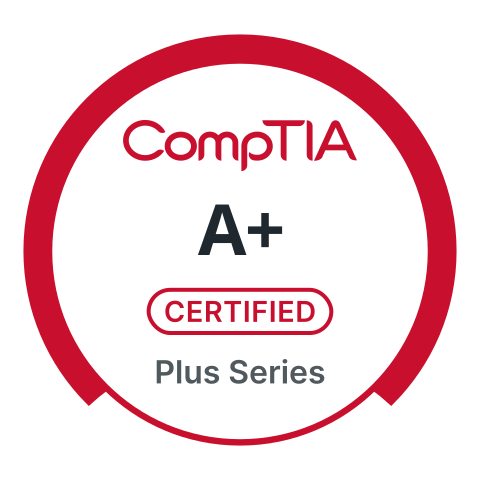
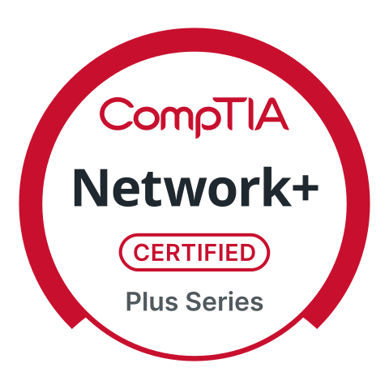
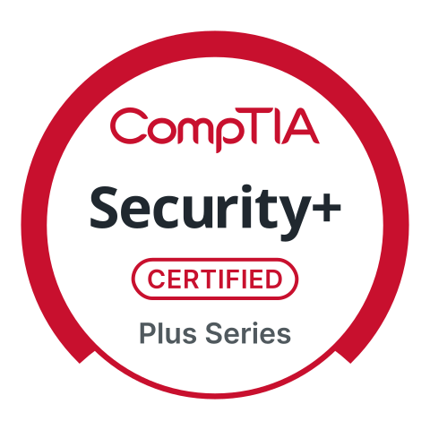

# Romel Dawson

### 1st / 2nd Line IT Support · Service Desk Technician

CompTIA-certified support technician with a background in field engineering at Openreach and a self-built Windows Server lab I use for daily hands-on practice. I resolve Windows, hardware, account and connectivity issues end to end, log and prioritise tickets to SLA, and explain technical problems clearly to non-technical users.

&nbsp;&nbsp;

&nbsp;&nbsp;

---

## About

After four years diagnosing and installing copper and fibre services at Openreach, I self-funded a full retrain into IT, earning the CompTIA A+, Network+ and Security+ along the way. To turn the certifications into real skill, I built a home lab where I practise the everyday service desk queue: Active Directory user administration, Windows 10/11 support, and network troubleshooting, documenting every build and fix as I go.

I'm methodical, reliable and security-aware, and I'm looking for a 1st or 2nd line service desk / IT support role where I can resolve issues end to end and keep users productive.

## Technical Skills

**Service Desk & Windows**

**Networking**

**Virtualisation & Platforms**

**Scripting & Security**

## Featured Projects

🖥️ **[Active Directory Lab — Tiered "Fakelab Inc." Domain](https://github.com/R0me1/homelab-documentation/blob/main/active-directory-lab.md)**
A Windows Server 2025 domain built on Microsoft's tiered administration model and provisioned by an idempotent PowerShell script. Realistic Level 1–3 helpdesk practice, NTFS-permissioned departmental file shares, mapped to NIST guidance.

☁️ **[Self-Hosted Services](https://github.com/R0me1/homelab-documentation/blob/main/self-hosted-services.md)**
Private, self-hosted Nextcloud and Immich (a privacy-first replacement for iCloud), reachable only over an encrypted WireGuard VPN, no services exposed to the public internet.

🛠️ **[Homelab Documentation](https://github.com/R0me1/homelab-documentation)**
The full library, Active Directory, DNS hardening, firewall and OPNsense, IDS/IPS with Suricata, and network security — with each build and fix written up.

---

<i>Open to 1st / 2nd line IT support and service desk roles — London or remote.</i>

